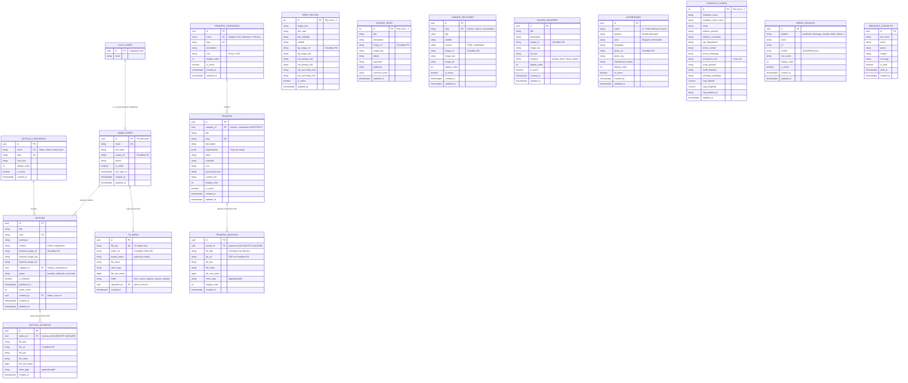

# Diagrama Entidad-Relación (MER) — Base de Datos GAM Pelechuco

```mermaid
erDiagram
    AUTH_USERS ||--o| ADMIN_USERS : "1 a 1 (Autenticación Supabase)"
    ADMIN_USERS ||--o{ NOTICIAS : "redacta / publica"
    ADMIN_USERS ||--o{ R2_MEDIA : "sube archivos R2"

    NOTICIAS_CATEGORIAS ||--o{ NOTICIAS : "clasifica"
    NOTICIAS ||--o{ NOTICIAS_ADJUNTOS : "incluye documentos PDF"

    TRAMITES_CATEGORIAS ||--o{ TRAMITES : "clasifica"
    TRAMITES ||--o{ TRAMITES_ARCHIVOS : "adjunta formularios PDF"

    HERO_SECTION {
        int id PK "Fila única = 1"
        string badge_text
        string title_main
        string title_highlight
        string subtitle
        string bg_image_url "Cloudflare R2"
        string bg_image_key
        string cta_primary_text
        string cta_primary_link
        string cta_secondary_text
        string cta_secondary_link
        boolean is_active
        timestamptz updated_at
    }

    CONOCE_INTRO {
        int id PK "Fila única = 1"
        string title
        string description
        string image_url "Cloudflare R2"
        string image_key
        string altitud
        string superficie
        string poblacion
        string cantones_texto
        timestamptz updated_at
    }

    CONOCE_SECCIONES {
        uuid id PK
        string slug UK "historia, cultura, comunidades"
        string title
        string subtitle
        string content "HTML o Markdown"
        string image_url "Cloudflare R2"
        string image_key
        string image_alt
        int display_order
        boolean is_active
        timestamptz created_at
        timestamptz updated_at
    }

    GALERIA_IMAGENES {
        uuid id PK
        string title
        string description
        string image_url "Cloudflare R2"
        string image_key
        string alt_text
        string category "paisaje, fauna, obras, cultura"
        int display_order
        boolean is_active
        timestamptz created_at
        timestamptz updated_at
    }

    AUTH_USERS {
        uuid id PK "Supabase Auth"
        string email
    }

    ADMIN_USERS {
        uuid id PK "FK auth.users"
        string email UK
        string full_name
        string avatar_url "Cloudflare R2"
        string phone
        boolean is_active
        timestamptz last_login_at
        timestamptz created_at
        timestamptz updated_at
    }

    R2_MEDIA {
        uuid id PK
        string file_key UK "R2 Object Key"
        string public_url "Cloudflare CDN URL"
        string bucket_name "pelechuco-media"
        string file_name
        string mime_type
        bigint file_size_bytes
        string folder "hero, conoce, galeria, noticias, tramites"
        uuid uploaded_by FK "admin_users.id"
        timestamptz created_at
    }

    NOTICIAS_CATEGORIAS {
        uuid id PK
        string name UK "Obras, Salud, Institucional..."
        string slug UK
        string color_hex
        int display_order
        boolean is_active
        timestamptz created_at
    }

    NOTICIAS {
        uuid id PK
        string title
        string slug UK
        string summary
        string content "HTML o Markdown"
        string featured_image_url "Cloudflare R2"
        string featured_image_key
        string featured_image_alt
        uuid category_id FK "noticias_categorias.id"
        string status "borrador, publicado, archivado"
        boolean is_featured
        timestamptz published_at
        int views_count
        uuid created_by FK "admin_users.id"
        timestamptz created_at
        timestamptz updated_at
    }

    NOTICIAS_ADJUNTOS {
        uuid id PK
        uuid noticia_id FK "noticias.id (ON DELETE CASCADE)"
        string file_title
        string file_url "Cloudflare R2"
        string file_key
        string file_name
        bigint file_size_bytes
        string mime_type "application/pdf"
        timestamptz created_at
    }

    AUTORIDADES {
        uuid id PK
        string name "Lic. Pedro Mamani Huanca"
        string position "Alcalde Municipal"
        string area "Despacho del Alcalde"
        string biography
        string photo_url "Cloudflare R2"
        string photo_key
        string institutional_contact
        int display_order
        boolean is_active
        timestamptz created_at
        timestamptz updated_at
    }

    TRAMITES_CATEGORIAS {
        uuid id PK
        string name UK "Registro Civil, Urbanismo, Tributos..."
        string slug UK
        string description
        string icon "Emoji o SVG"
        int display_order
        boolean is_active
        timestamptz created_at
        timestamptz updated_at
    }

    TRAMITES {
        uuid id PK
        uuid category_id FK "tramites_categorias.id (RESTRICT)"
        string title
        string slug UK
        string description
        jsonb requirements "Array de strings"
        string office
        string schedule
        string cost
        string processing_time
        string contact_info
        int display_order
        boolean is_active
        timestamptz created_at
        timestamptz updated_at
    }

    TRAMITES_ARCHIVOS {
        uuid id PK
        uuid tramite_id FK "tramites.id (ON DELETE CASCADE)"
        string file_title "Formulario de Solicitud"
        string file_url "PDF en Cloudflare R2"
        string file_key
        string file_name
        bigint file_size_bytes
        string mime_type "application/pdf"
        int display_order
        timestamptz created_at
    }

    CONTACTO_CONFIG {
        int id PK "Fila única = 1"
        string institution_name
        string institution_short_name
        string motto
        string address_primary
        string address_secondary
        string city_department
        string phone_central
        string phone_whatsapp
        string emergency_line "Línea 114"
        string email_general
        string email_dispatch
        string schedule_weekdays
        numeric map_latitude
        numeric map_longitude
        string map_embed_url
        timestamptz updated_at
    }

    REDES_SOCIALES {
        uuid id PK
        string platform "facebook, whatsapp, youtube, tiktok, twitter_x"
        string name
        string url
        string handle "@GAMPelechuco"
        string icon_name
        int display_order
        boolean is_active
        timestamptz created_at
        timestamptz updated_at
    }

    MENSAJES_CONTACTO {
        uuid id PK
        string full_name
        string email
        string phone
        string subject
        string message
        boolean is_read
        timestamptz read_at
        timestamptz created_at
    }
```
